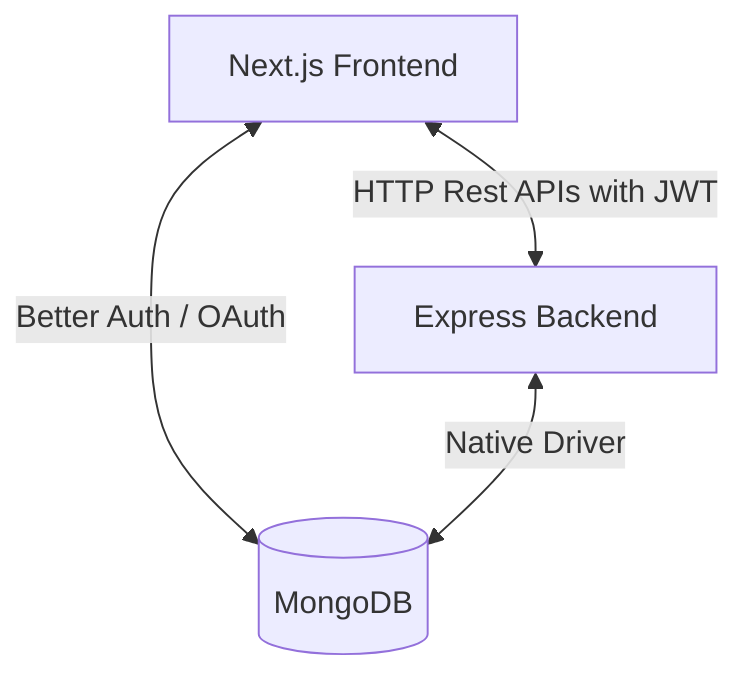

# 🗺️ Wayfarer — Premium Rental Listing & Booking Platform

Wayfarer is a full-stack, state-of-the-art accommodation rental directory and booking platform. It features a stunning responsive UI with glassmorphism aesthetics, a dynamic category explorer, and dual-layered authentication.

---

## 🏗️ Project Architecture

Wayfarer is built as a decoupled monorepo:
1. **Frontend (`new-project`)**: Next.js 16 (App Router), Tailwind CSS v4, HeroUI (formerly NextUI) components, and Better Auth.
2. **Backend (`new-project-server`)**: Node.js, Express, TypeScript, native MongoDB driver, and JWT-based request authorization.



---

## 🔑 Dual-Layered Authentication System

To bridge Next.js Server Actions/Components with the Express REST API, Wayfarer uses a synchronized auth system:
1. **Frontend Auth**: Handled by **Better Auth** using a direct MongoDB adapter connection inside the Next.js app to manage sessions.
2. **Backend Auth**: Handled by **Express JWT** middlewaring.
3. **Synchronization**: On login, or when making an authenticated backend request (like booking or listing creation), the frontend calls `api.ensureExpressToken(user)`. 
   - This automatically registers or logs in the user on the Express API using a deterministic password derivation.
   - The received Express JWT token is cached in `localStorage` under `wayfarer_token` alongside `wayfarer_role`.
   - Subsequent calls to the Express API append `Authorization: Bearer <token>` automatically in the `api` service header.

---

## 🗄️ Database Collections

The application uses **MongoDB** as its database. The following collections are utilized:

| Collection | Description | Key Fields |
| :--- | :--- | :--- |
| `users` | User credentials and profile accounts | `name`, `email`, `password` (hashed), `role` (`user` \| `admin`) |
| `items` | Property accommodation listings | `title`, `category`, `price`, `location`, `images`, `rating`, `reviews`, `userId` |
| `bookings` | Customer property reservations | `propertyId`, `checkIn`, `checkOut`, `guests`, `totalPrice`, `userId`, `status` |
| `sessions` / `accounts` | Managed by Better Auth | Session tracking and user verification records |

---

## 🚀 Getting Started & Local Setup

To run both applications locally, follow these steps:

### 1. Prerequisites
- **Node.js** (v18.x or above recommended)
- **MongoDB Database** (A local MongoDB instance or a MongoDB Atlas cloud URI)

---

### 2. Backend Server Setup (`new-project-server`)

Navigate to the backend directory `new-project-server/`:

1. **Install Dependencies**:
   ```bash
   npm install
   ```

2. **Configure Environment Variables**:
   Create a `.env` file in the root of the `new-project-server` folder:
   ```env
   # Server Connection
   PORT=5000
   NODE_ENV=development

   # MongoDB
   MONGODB_URI=your_mongodb_connection_uri
   MONGODB_DATABASE=new-project-server

   # JWT Token Secret
   JWT_SECRET=wayfarer-super-secret-key-2026
   ```

3. **Seed Database**:
   Populate the database with pre-configured items, reviews, and test accounts:
   ```bash
   npm run seed
   ```
   *Expected console output: `🌱 Seeding database...` followed by `✅ 10 sample items created` and `🎉 Seeding complete!`*

4. **Start Development Server**:
   ```bash
   npm run dev
   ```
   The backend will start and listen on [http://localhost:5000](http://localhost:5000).

---

### 3. Frontend Next.js Setup (`new-project`)

Navigate to the frontend directory `new-project/`:

1. **Install Dependencies**:
   ```bash
   npm install
   ```

2. **Configure Environment Variables**:
   Create a `.env` file in the root of the `new-project` folder:
   ```env
   # Better Auth Secret (Generate a secure key)
   BETTER_AUTH_SECRET=Y9f9XxsezdN4ZkuImJ7N0Mc2hDeiadQv
   BETTER_AUTH_URL=http://localhost:3000

   # MongoDB (Shared with Backend or Separate database)
   MONGODB_URI=your_mongodb_connection_uri
   MONGODB_DATABASE=new-project-server

   # Backend REST API endpoint URL
   NEXT_PUBLIC_API_URL=http://localhost:5000/api
   ```

3. **Start Development Server**:
   ```bash
   npm run dev
   ```
   The application will be accessible at [http://localhost:3000](http://localhost:3000).

---

## 👥 Seeding / Default Accounts

When the database is seeded, the following accounts are created for testing application capabilities:

| Account Type | Email | Password | Allowed Capabilities |
| :--- | :--- | :--- | :--- |
| **Demo User** | `demo@wayfarer.com` | `Demo@123` | Explore listings, create new listings, leave reviews, book stays, view personal dashboard. |
| **Administrator** | `admin@wayfarer.com` | `Admin@123` | Access Admin panel, view all site statistics, manage users, modify booking statuses. |

---

## 🗺️ Key Features & Page Directory

### Frontend Web Routes
- **`/explore`**: Accommodation listings featuring search parameters, category selection, range pricing sliders, rating filtering, and custom sorting.
- **`/items/[id]`**: Detail page showing rich description, review logs, image carousels, and an integrated reservation booking request form.
- **`/addListing`**: Property listing form checking and syncing authenticated roles.
- **`/dashboard`**: Customer portal displaying upcoming reservations, profile details, and listings published by the logged-in user.
- **`/admin`**: Master system control panel with overall KPIs (revenue, active users, bookings count), and user management lists.

### Backend Endpoints API Map
- **`POST /api/auth/register`** — Register new users.
- **`POST /api/auth/login`** — Log in existing users and issue JWTs.
- **`GET /api/auth/profile`** — Fetch profile payload.
- **`GET /api/items`** — Get paginated listings matching search and category queries.
- **`POST /api/items`** — Create a new property listing (Token required).
- **`DELETE /api/items/:id`** — Delete own property listing (Token required).
- **`POST /api/bookings`** — Reserve properties (Token required).
- **`GET /api/bookings/my-bookings`** — Retrieve guest reservations (Token required).
- **`GET /api/admin/stats`** — Fetch administration logs (Admin token required).
- **`PATCH /api/bookings/:id/status`** — Update booking status (Admin token required).
